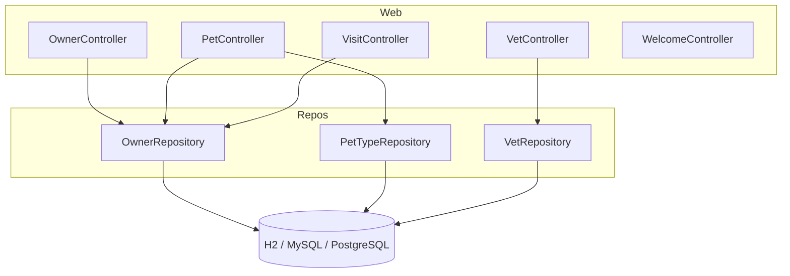
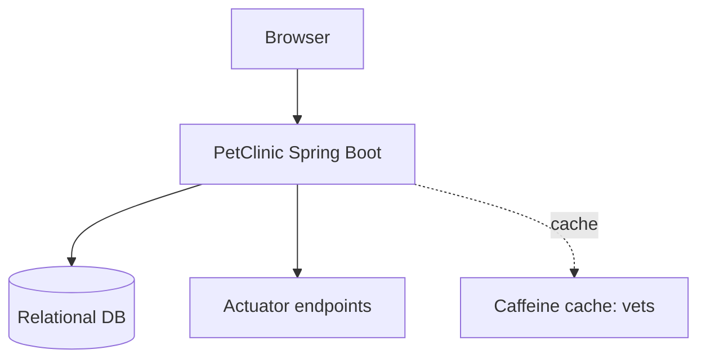

# Architecture

> Project: spring-petclinic
> Type: rest-api
> Skill: spring-analysis
> Analyzed: 2026-06-28T00:00:00Z

---

## Build Profile

| Property | Value |
|---|---|
| Spring Boot version | 4.1.0 (`pom.xml:9`) |
| Java version | 17 (`pom.xml:21`) |
| Build tool | Maven (`pom.xml`) |
| Database | H2 (default), MySQL, PostgreSQL |
| Message broker | None |
| View layer | Thymeleaf |
| Cache | Caffeine via JCache (`pom.xml`) |

## Dependency Categories

**Web** — `spring-boot-starter-webmvc`, `spring-boot-starter-thymeleaf`, `spring-boot-starter-validation`
**Data** — `spring-boot-starter-data-jpa`, `h2` (runtime), `mysql-connector-j` (runtime), `postgresql` (runtime)
**Cache** — `spring-boot-starter-cache`, `caffeine` (runtime), `cache-api`
**Ops** — `spring-boot-starter-actuator`, `spring-boot-devtools` (optional)
**Front-end assets** — `webjars-locator-lite`, `bootstrap`, `font-awesome`

## Layer Organization

| Package | Pattern | Purpose |
|---|---|---|
| `petclinic` | Bootstrap | `PetClinicApplication`, runtime hints |
| `petclinic.model` | Domain base | `BaseEntity`, `NamedEntity`, `Person` mapped superclasses |
| `petclinic.owner` | Feature module | Owner/Pet/Visit controllers, entities, repos, validators |
| `petclinic.vet` | Feature module | Vet/Specialty entities, controller, repo, caching |
| `petclinic.system` | Cross-cutting | Cache, i18n, welcome, crash showcase |

## Component Model

## Ecosystem Position

## Notes

- `spring.jpa.open-in-view=false` (`application.properties`) — lazy loading is closed outside the request; entities use `FetchType.EAGER` collections to compensate.
- Schema/data are seeded via `db/${database}/schema.sql` + `data.sql`; `ddl-auto=none`.
- Actuator exposes all endpoints (`management.endpoints.web.exposure.include=*`) — flagged for dev only in `application.properties`.
