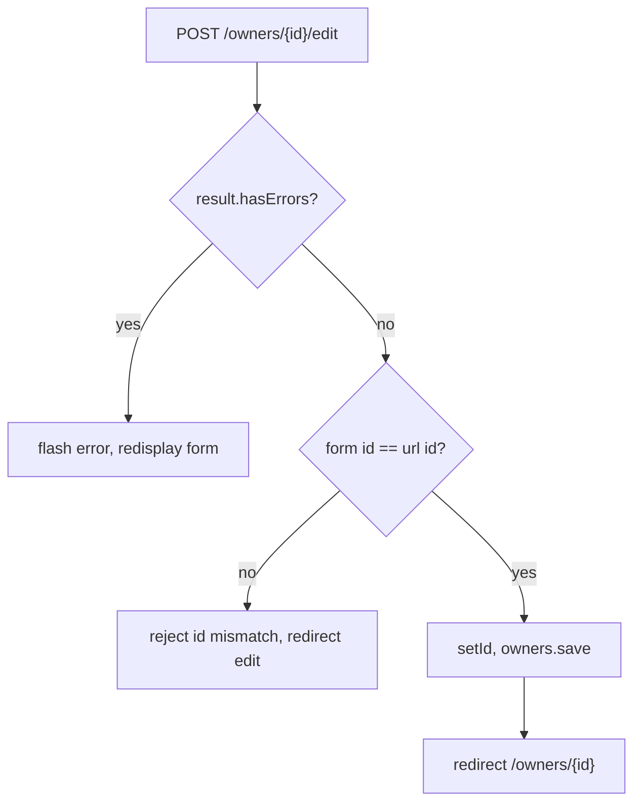
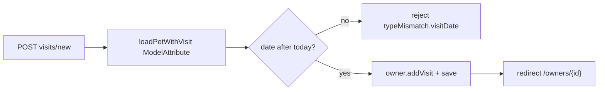
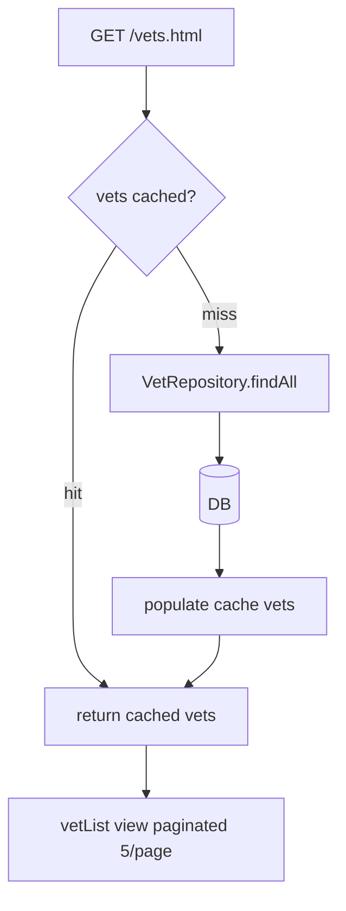

# Data Flow

> Project: spring-petclinic1
> Type: rest-api
> Skill: spring-analysis
> Analyzed: 2026-06-28T00:00:00Z

---

## Owner Update

```mermaid
flowchart TD
  A["POST /owners/{id}/edit"] --> B{result.hasErrors?}
  B -->|yes| C[flash error, redisplay form]
  B -->|no| D{form id == url id?}
  D -->|no| E[reject id mismatch, redirect edit]
  D -->|yes| F[setId, owners.save]
  F --> G["redirect /owners/{id}"]
```

## Visit Booking

```mermaid
flowchart LR
  A[POST visits/new] --> B[loadPetWithVisit ModelAttribute]
  B --> C{date after today?}
  C -->|no| D[reject typeMismatch.visitDate]
  C -->|yes| E[owner.addVisit + save]
  E --> F["redirect /owners/{id}"]
```

## Vet List with Cache

```mermaid
flowchart TD
  A[GET /vets.html] --> B{vets cached?}
  B -->|hit| C[return cached vets]
  B -->|miss| D[VetRepository.findAll]
  D --> E[(DB)]
  E --> F[populate cache vets]
  F --> C
  C --> G[vetList view paginated 5/page]
```
